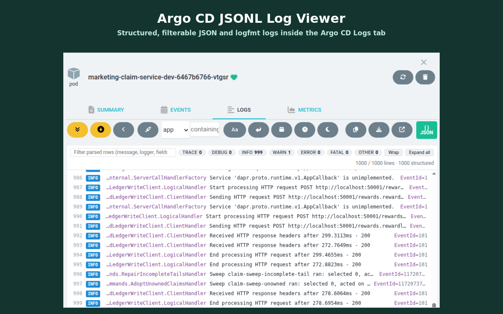

<p align="center">
  
</p>

<h1 align="center">Argo CD Logs Prettifier</h1>

<p align="center">Chrome extension that turns JSON / logfmt log lines in the Argo CD pod <b>Logs</b> tab into structured, filterable rows.</p>

<p align="center">
  
</p>

Argo CD renders container logs as plain text. When services log one JSON object per line, the Logs tab is a wall
of braces. This extension parses each line the Argo CD UI already displays and re-renders it on the same page:
level badge, time, logger, message and extra fields, an expandable colour-coded record, level and text filters.
Argo's own controls (container, follow, tail, since, filter, dark mode) keep working, and a `{ } JSON` button in
Argo's log toolbar toggles the view at any time.

## Install

**Chrome Web Store:** coming soon.

**From source (unpacked):**

1. Clone this repository.
2. Open `chrome://extensions`, enable **Developer mode**, click **Load unpacked** and select the `extension/`
   directory.

## Setup

1. Open your Argo CD instance, click the extension icon and choose **Enable on this site**. Chrome asks you to
   allow the extension on that site. (**Settings…** in the same menu lists the enabled instances and lets you
   add one by address or remove it.)
2. Open any pod's **Logs** tab in Argo CD. Rows are parsed automatically; use the green `{ } JSON` button in the
   log toolbar to switch between the structured view and Argo's raw lines. The choice is remembered.

## Features

- Line number, time (`HH:MM:SS.mmm`, full value on hover), level badge, logger, message and up to six extra
  fields per row.
- Click a row to expand the full record as syntax-coloured JSON, with **Copy JSON** / **Copy raw**.
- Level chips (`TRACE` … `FATAL`, `OTHER`) show counts and filter rows; Ctrl/Alt-click a chip to show only that
  level, Ctrl/Alt-click it again to show all.
- Text filter on message, logger, pod name or raw line (in addition to Argo's server-side filter).
- **Wrap** long messages, **Expand all** / collapse all.
- Follows live logs: when the list is scrolled to the bottom, new lines keep it there.
- Dark-mode styling when Argo CD's dark mode is on.

## Recognised formats

- JSON objects, whole line or after a timestamp/prefix, including .NET Microsoft.Extensions.Logging JSON
  (`LogLevel`/`Category`/`Message`/`State`/`Scopes`), dapr, pino (numeric levels), Serilog compact
  (`@l`/`@m`/`@t`) and OpenTelemetry-style (`severity_text`/`body`).
- logfmt (`time=… level=… msg=…`).
- Trace ids from `trace_id`/`traceId`/`TraceId`, also inside .NET `Scopes`.
- Anything else stays a raw line (a level word such as `ERROR` in the first 120 characters is still used for the
  badge).

## Privacy

Everything runs in the browser; nothing is sent anywhere. See [PRIVACY.md](PRIVACY.md).

## Development

```sh
npm test          # parser tests against the real log samples in samples/
npm run icons     # re-render extension/icons/*.png from assets/logo.svg (ImageMagick)
npm run package   # build dist/argocd-logs-prettifier-<version>.zip for the Chrome Web Store
```

Layout:

```
extension/   the unpacked extension (manifest v3, content script, options page, background worker)
assets/      logo source (SVG)
samples/     real log lines used by the tests (.NET JSON, dapr JSON, logfmt)
store/       Chrome Web Store listing text and screenshot
scripts/     packaging and icon rendering
test/        parser tests
```

Store listing text, permission justifications and publishing steps are in [CHROMEWEBSTORE.md](CHROMEWEBSTORE.md). Changes are tracked in
[CHANGELOG.md](CHANGELOG.md).

## License

[MIT](LICENSE)
